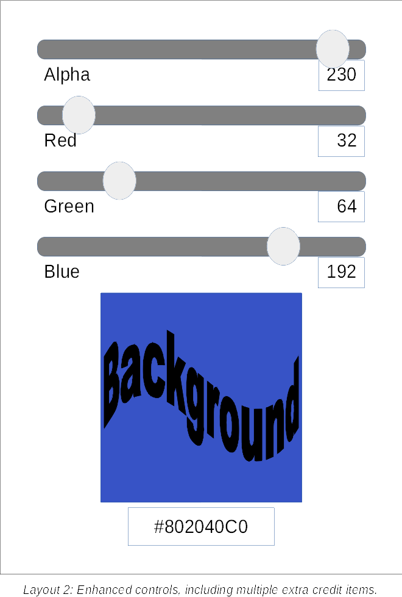

## Value

* Basic implementation: 30 points
* Extra credit implementation: 20 points

## Basic task

Build an Android app with a single activity, which allows the user to specify a combination of red, green, and blue values, and then displays the color made up of the combination of those color component values.

### Implementation

1. The UI must include the following components:

    * Three sliders (`SeekBar` components), or editable text fields (`EditText` or `TextInputEditText`), each with a minimum value of 0, and a maximum value of 255. These components should be labeled (in some fashion) as "Red", "Green", and "Blue". If you use sliders, each should also be accompanied by a static text component (`TextView`), displaying the current value of that slider, using a base-10 representation.

    * A square "swatch" (`ImageView` or a subclass) for displaying a solid color (which will be composed from the levels of red, green, and blue specified by the slider or text field values). 

    * A `TextView` (or editable text field, for extra credit), containing the integer value (expressed in a _hexadecimal_, or base-16, representation) corresponding to the combination of specified RGB color values.

    The portrait-orientation layout should closely resemble the layout wireframe below. If using editable text fields, rather than sliders, the relative positioning of the 3 fields should be the same as it would be for the sliders.

    
    
2. As any of the three sliders or editable fields is adjusted, the following should update automatically:

    * The color component value displayed next to the given slider (if sliders are used).

    * The color displayed in the swatch area.

    * The hexadecimal color value displayed below the swatch.

3. The application must not throw an exception (let alone terminate) if an invalid value is entered in any field. Instead, input should be filtered as appropriate, to prevent entry of invalid values and/or recover in a reasonably intuitive, user-friendly manner.

4. Any UI text must be read from resources.

Keep in mind that while part of this task is to implement the layout as specified&mdash;especially with regard to the stated alignment of controls&mdash;you should exercise your best judgement on placement of slider labels, color value text, etc.

## Extra credit

Additional points may be earned by including one of more of the following:

1. For each color component, allow entry both by slider _and_ editable text field. Any change in one should be reflected in the other&mdash;and should also result in updating the color swatch and the hexadecimal color value, of course.

2. If editable text fields are used, include support for the 3-digit shorthand hexadecimal color representation (where, for example, `#ABC` is treated as a shorthand for `#AABBCC`). Note that if you implement this feature, it must be in addition to, not instead of, support for the 6-digit representation.

3. An additional set of slider/label/field controls for setting the alpha (opacity) of the color (see layout 2). Note that when alpha level is included, the combined hexadecimal color value contains 8 digits, with the first 2 representing the alpha level, where `00` is fully transparent and `FF` is fully opaque.

    

4. Support for orientation changes, with an alternate layout (see layout 3) used in landscape mode.

    

5. Use of a single layout element, without additional nested layouts (with the possible exception of `TextInputLayout` components).

6. Use of dimension &amp; style resources (Android) for detailed formatting/styling.
